<!-- # Logbook

## Initial meetings (2 h)

setting up initial meetings and going.

## Reading (6 h)
Reading up on initial papers and learning how to make pytorch modules. -->

<!-- ## 16.10.23 (9 h) -->

# DDSP logbook

## Initial 'toy' system
I have implemented a modular system in pytorch, with the following:
  
1. **FIRFilter1D**:
   - Implements an arbitrary phase FIR filter using a 1D convolutional layer.
   - The filter taps are learnable parameters.

2. **FIRFilter1DLinearPhaseI**:
   - Implements a linear phase FIR type I filter using 1D convolution.
   - Only allows an odd number of taps and enforces type I symmetry in the filter taps.
   - Taps are learnable parameters (only from the mid-index and up).

3. **GammaToneFilter**:
   - Impulse response of the filter is computed based on specified parameters like center frequency, sampling frequency, and impairment factor
     - !Impairing like this makes no sense just something I did for the toy example.
   - The filter is applied to the input signal using a 1D convolutional layer.

4. **GammaToneFilterbank**:
   - Uses the `GammaToneFilter` module to create individual filters and applies them to the input signal as a filterbank.

5. **NormalModel**:
   - Uses a `GammaToneFilterBank` to process the input with no pre-gain (FIR filter).

6. **ImpairedModel**:
   - Uses a `FIRFilter1D` to apply a learnable gain filter to process which then gets processed by `GammaToneFilterBank`.
   - The gain filter is implemented using `FIRFilter1D`, I have not tried using `FIRFilter1DLinearPhaseI`, although it should work with no issues.

7. **MyModel_v1**:
   - A trainable model composed of a normal hearing model and an impaired hearing model.
   - Uses the `NormalModel` and `ImpairedModel` to process the input and produce outputs for normal and impaired hearing, respectively.

I have tried training a `NormalModel` using SGD with the SI-SDR loss between normal and impaired outputs as the loss function, which was successful. The results are presented under RESULTS below.

### Next steps

- [ ] Try to mimic how the DHASP paper implemented the diffrentiable perceptual model.
- [ ] Try to mimic how the DHASP paper implemented the diffrentiable hearing-aid processing model.
- [ ] Introduce a perceptual loss to optimize the NN.

<!-- ## 17.10.23 (5h) -->

<!-- Worked on debugging the initial modules and making a showcase what I've done. Trained overfitted a model on a single piece of data to showcase that it works, which worked very well.

      Acheived a SI SDR loss of -7.8, and the audio files      perceptually sound similar (with the exception of LF). The gain filter learned to be a "filterbank" to recreate the output of the NH model. -->
## RESULTS
### Normal Hearing filterbank used:

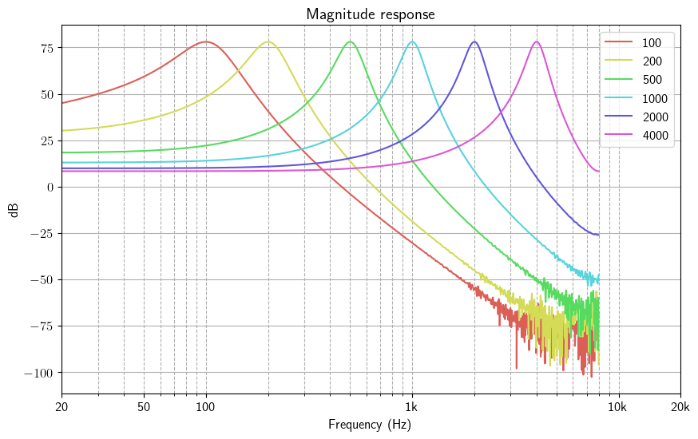
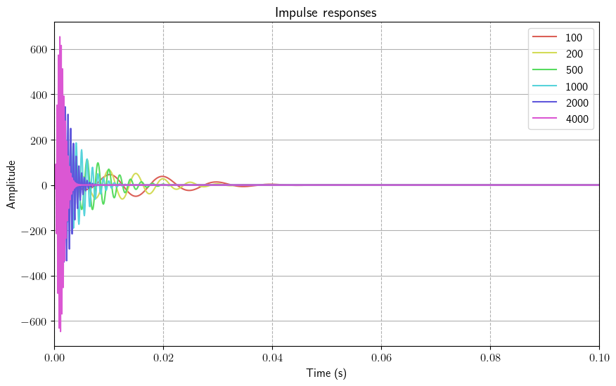

### Impaired filterbank used:

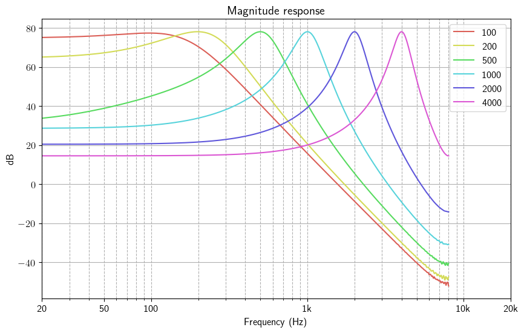
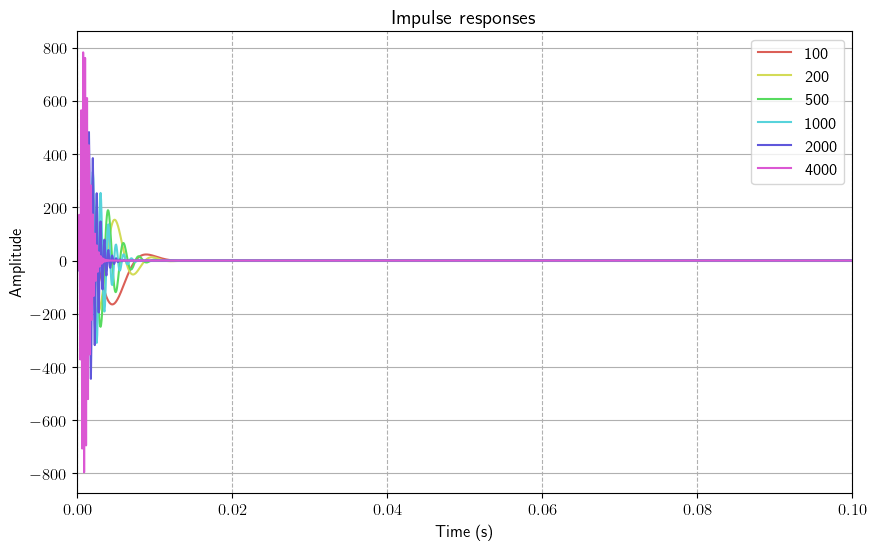

### Input-output of untrained model

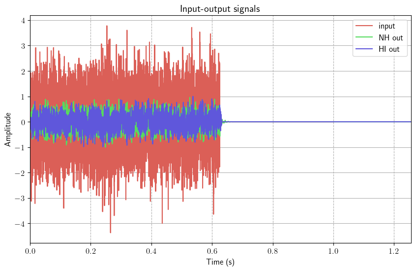
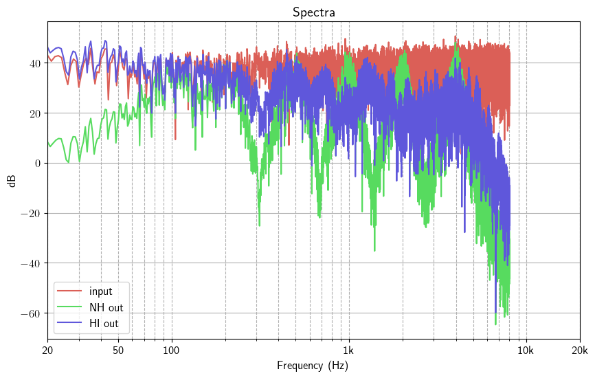

input

<audio src="audio/x_noise.wav" controls title="Title"></audio>

normal out (target)

<audio src="audio/untrained_output_NH.wav" controls title="Title"></audio>

untrained impaired out

<audio src="audio/untrained_output_HI.wav" controls title="Title"></audio>

trained impaired out

<audio src="audio/trained_output_HI.wav" controls title="Title"></audio>
### Input-output of trained model

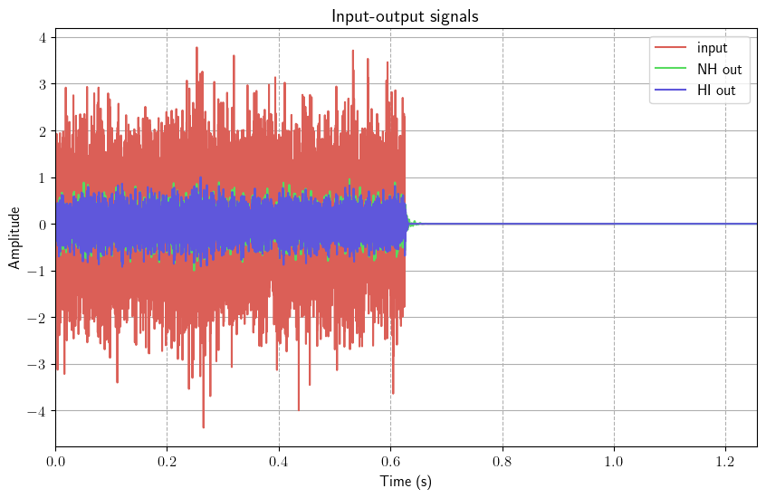
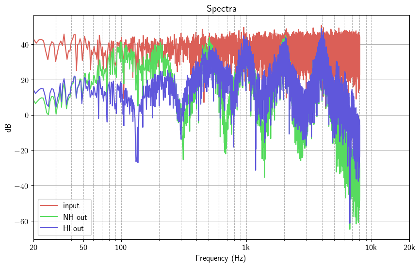

### Learned filter

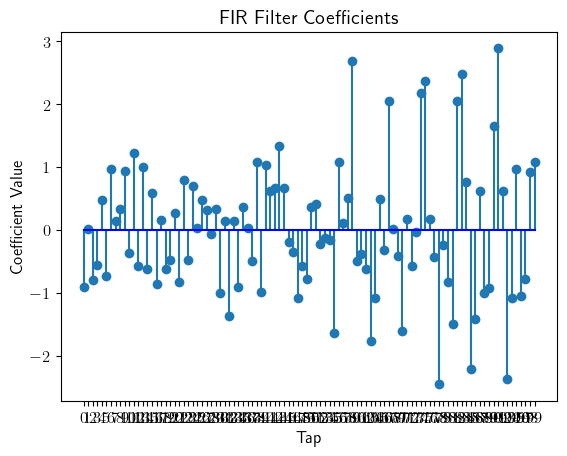
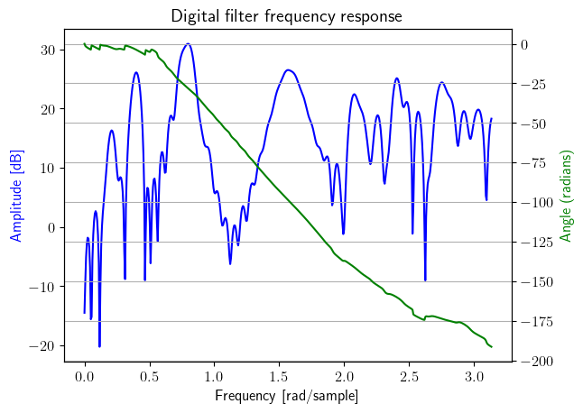

unnormalized frequency

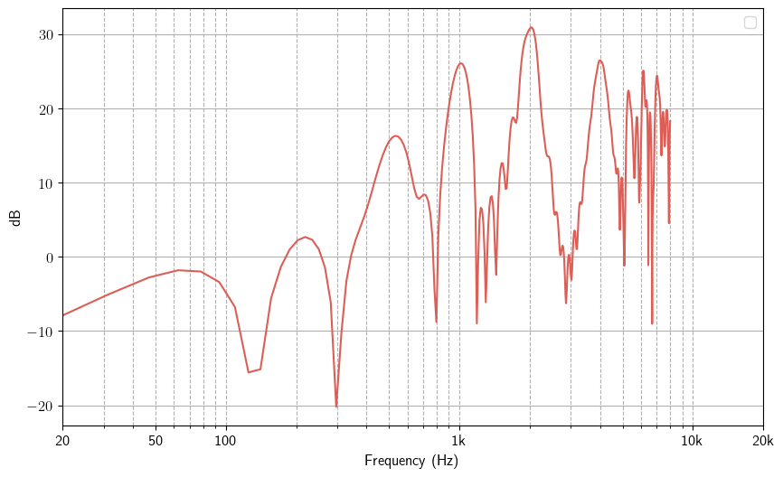